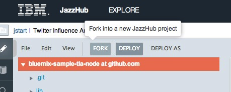

# How to Run and Deploy the Node MySQL Upload App #

## Overview of the app ##

This is a NodeJS app that uses the following cloud services:

-   MySQL Database

This app demonstrates how to connect to a MySQL database on codename: BlueMix from a NodeJS app. 
Simply upload a line-separated file of text (e.g. tweets), and it will add each line to MySQL.

## Deploying the App and Binding the MySQL Service ##
Multiple methods exist for interacting with the BlueMix platform. Outlined below are two of those methods:

1. [Command-Line](#method-command-line) 
2. [IBM JazzHub](#method-ibm-jazzhub)

### Method: Command-Line ###
#### Prerequisites ####

Before we begin, we first need to install the [**cf**](https://github.com/cloudfoundry/cli/releases) command line tool that will be used to upload and manage your application. If you've previously installed an older version of the cf tool, make sure you are now using v6 of cf by passing it the -v flag:

    cf -v

#### Steps ####
In the terminal, go into the directory named **app**, and follow these steps.

1. Login to Bluemix.

   | *usage:*   | `$ cf login [-a API_URL] [-o ORG] [-s SPACE]`|
   |------------|----------------------------------------------|
   | *example:* | `$ cf login -a https://api.ng.bluemix.net`   |

2. Create an instance of the ClearDB MySql service, giving it a unique name in the last argument.

   | *usage:*   | `$ cf create-service SERVICE PLAN SERVICE_INSTANCE_NAME`|
   |------------|---------------------------------------------------------|
   | *example:* | `$ cf create-service cleardb spark mysql_node           |

3. If you used a service instance name different than mysql_node, change the line of the `app/manifest.yml` file below "services:" to reflect that:
   | *old:*     | - mysql_node                                       |
   |------------|----------------------------------------------------|
   | *new:*     | - SERVICE_INSTANCE_NAME                            |

4. **From the directory that houses the _app.js_ file** (not from the root directory that contains this *README.md* file), push the app with the --no-start option so we can bind our required service before starting.  Pass the -c flag to specify the start command that should be used by CloudFoundry to run your app.  Be sure to give your app a unique app name to be used for its hostname; for instance the example below would result in http://myupload-<username>.ng.bluemix.net.

   | *usage:*   | `$ cf push |
   |------------|------------|
   | *example:* | `$ cf push |
   

### Method: IBM JazzHub ###
1. Browse to the JazzHub project repository located [here](https://hub.jazz.net/project/jstart/MySQL%20Upload%20App%20(Node)/overview).  Click on **Edit Code** for the project.
2. Click on "Fork".  This will provide you with a personal copy of the code within your JazzHub project space.

  

3. Located in the **app** directory of the project, rename **manifest.yml.v5** to **manifest.yml**

  

4. Next, click on "Deploy".  This will use information within the **manifest.yml** to deploy the sample application directly into the codename: BlueMix platform.

  

  You may continue to deploy changes to your BlueMix application directly from JazzHub using the "Deploy" and "Deploy As" buttons.

5. Next, click on the Root Project Name and scroll to the **Manual Deployment Information** section.

  

  You can check the status of the app using this section. If a green filled circle is visible, you may click the Application Name shown within the section and interact with the running application.  However, if a red filled circle is displayed, you may click **Manage** and directly interact with the BlueMix User interface for further investigation and debugging.

## License ##
Licensed under the Apache License, Version 2.0 (the "License"); you may not use this file except in compliance with the License. You may obtain a copy of the License at

     http://www.apache.org/licenses/LICENSE-2.0

Unless required by applicable law or agreed to in writing, software distributed under the License is distributed on an "AS IS" BASIS, WITHOUT WARRANTIES OR CONDITIONS OF ANY KIND, either express or implied. See the License for the specific language governing permissions and limitations under the License.
