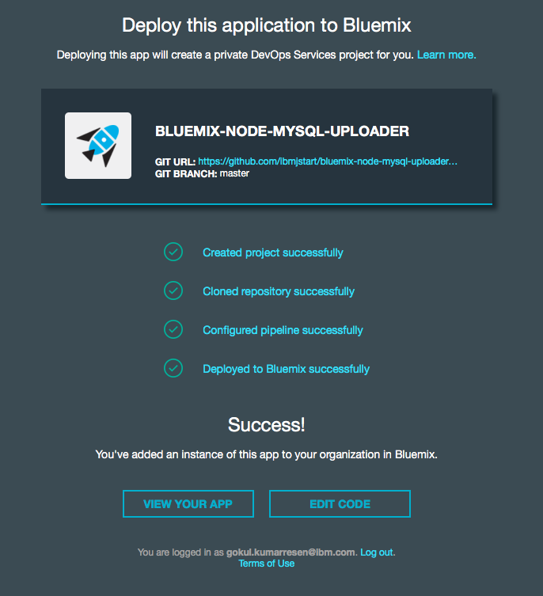

# Overview of the App #

This is a Node.js app that uses the following cloud services:

-   MySQL Database

This app demonstrates how to connect to a MySQL database on IBM BlueMix from a Node.js app. 
Simply upload a line-separated file of text (e.g. tweets), and it will add each line to MySQL.

Give it a try! Click the button below to fork into IBM DevOps Services and deploy your own copy of this application on Bluemix.

Once on the page, log into your Bluemix account, deploy your app, and you should see a screen like this:

Click on the "View Your App" button, and enjoy! 

___

### [Alternative] Deploying the App Via the Command-Line ###

#### Prerequisites ####

Before we begin, we first need to install the [**cf**](https://github.com/cloudfoundry/cli/releases) command line tool that will be used to upload and manage your application. If you've previously installed an older version of the cf tool, make sure you are now using v6 of cf by passing it the -v flag:

    cf -v

#### Steps ####
Open your terminal and follow these steps.

1. Clone this repo into a local project

   `$ git clone https://github.com/ibmjstart/bluemix-node-mysql-uploader.git`

2. Navigate into your project directry and login to Bluemix.

   | *usage:*   | `$ cf login [-a API_URL] [-o ORG] [-s SPACE]`|
   |------------|----------------------------------------------|
   | *example:* | `$ cf login -a https://api.ng.bluemix.net`   |

3. Create an instance of the mySQL service, giving it the name "mysql-database" in the last arguement. Note, if a different name is desired, then the manifest.yml file needs to be changed accordingly.

   | *usage:*   | `$ cf create-service SERVICE PLAN SERVICE_INSTANCE`|
   |------------|----------------------------------------------------|
   | *example:* | `$ cf create-service mysql 100 mysql-database`     |

4. From the root directory that contains this *README.md* file, push the app like below.  Be sure to give your app a unique APP_NAME to be used for its hostname. For instance the example below would result in http://myupload-&lt;username&gt;.ng.bluemix.net.

   | *usage:*   | `$ cf push APP_NAME`                  |
   |------------|----------------------------------|
   | *example:* | `$ cf push myupload-<username>`  |

Congratulations, the app should be running on Bluemix.
   
___

### License ###
Licensed under the Apache License, Version 2.0 (the "License"); you may not use this file except in compliance with the License. You may obtain a copy of the License at

     http://www.apache.org/licenses/LICENSE-2.0

Unless required by applicable law or agreed to in writing, software distributed under the License is distributed on an "AS IS" BASIS, WITHOUT WARRANTIES OR CONDITIONS OF ANY KIND, either express or implied. See the License for the specific language governing permissions and limitations under the License.
